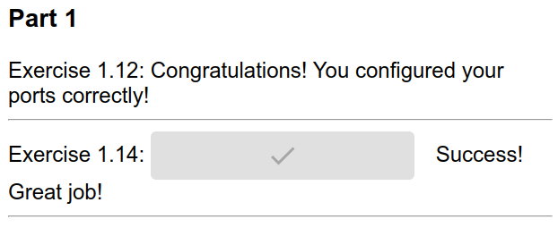

### Backend dockerfile:

FROM golang:1.16

WORKDIR /usr/src/app/

COPY . .

ENV REQUEST_ORIGIN http://localhost:5000

RUN go build 

EXPOSE 8080

CMD ./server

### Frontend dockerfile:

FROM node:16

WORKDIR /usr/src/app/

COPY . .

RUN npm install

ENV REACT_APP_BACKEND_URL http://localhost:8080/

RUN npm run build

RUN npm install -g serve

EXPOSE 5000

CMD serve -s -l 5000 build

### Commands:
sudo docker build . -t back

sudo docker run -p 8080:8080 back

sudo docker build . -t front

sudo docker run -p 5000:5000 front

